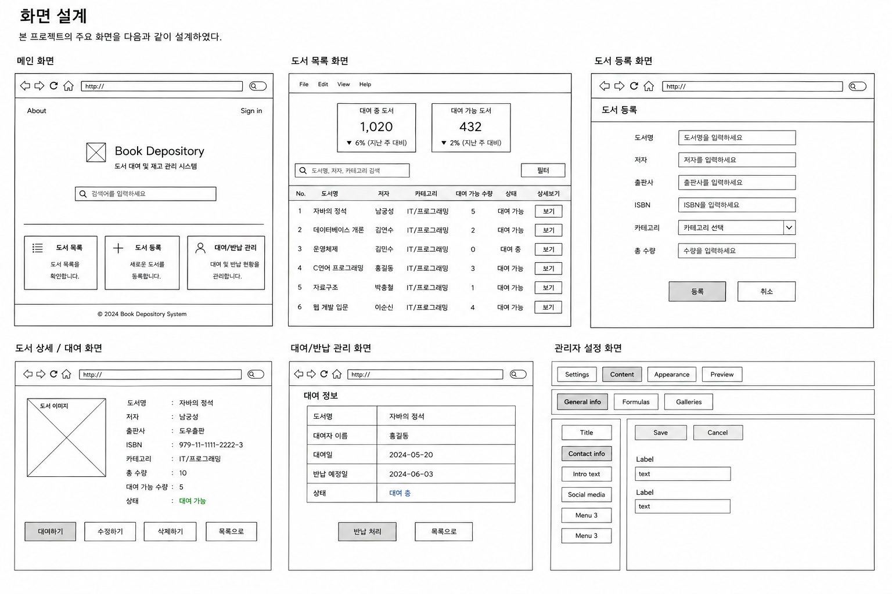

# 요구사항 및 설계 문서

## 1. 프로젝트명

도서 대여 및 재고 관리 시스템

---

## 2. 요구사항

### 2.1 요구사항 개요

본 프로젝트는 도서 정보를 등록하고, 도서의 대여 및 반납 상태를 관리하며, 현재 대여 가능 여부와 재고 상태를 확인할 수 있는 웹 기반 도서 관리 시스템이다.

사용자는 도서 목록을 조회하고, 도서 상세 정보를 확인할 수 있으며, 관리자는 도서 등록, 수정, 삭제와 대여/반납 상태 관리를 수행할 수 있다.

---

### 2.2 기능적 요구사항

| ID | 요구사항 | 상세 내용 | 우선순위 |
|---|---|---|---|
| F-01 | 도서 등록 | 관리자는 도서명, 저자, 출판사, ISBN, 카테고리, 총 수량을 입력하여 도서를 등록할 수 있다. | 높음 |
| F-02 | 도서 목록 조회 | 사용자는 등록된 도서 목록을 확인할 수 있다. | 높음 |
| F-03 | 도서 상세 조회 | 사용자는 특정 도서의 상세 정보와 대여 가능 여부를 확인할 수 있다. | 높음 |
| F-04 | 도서 정보 수정 | 관리자는 등록된 도서 정보를 수정할 수 있다. | 중간 |
| F-05 | 도서 삭제 | 관리자는 더 이상 관리하지 않는 도서를 삭제할 수 있다. | 중간 |
| F-06 | 도서 대여 | 사용자는 대여 가능한 도서를 대여할 수 있다. | 높음 |
| F-07 | 도서 반납 | 사용자는 대여한 도서를 반납할 수 있다. | 높음 |
| F-08 | 대여 상태 확인 | 시스템은 도서의 대여 가능 수량과 대여 중 상태를 표시한다. | 높음 |
| F-09 | 도서 검색 | 사용자는 도서명, 저자, 카테고리 기준으로 도서를 검색할 수 있다. | 중간 |

---

### 2.3 비기능적 요구사항

| ID | 요구사항 | 상세 내용 |
|---|---|---|
| NF-01 | 사용성 | 사용자가 쉽게 이해할 수 있도록 직관적인 화면을 제공한다. |
| NF-02 | 성능 | 주요 페이지는 3초 이내에 응답하도록 구현한다. |
| NF-03 | 호환성 | Chrome 브라우저 기준으로 정상 동작하도록 구현한다. |
| NF-04 | 유지보수성 | JSP, Servlet, DAO, DTO를 분리하여 MVC 구조를 유지한다. |
| NF-05 | 데이터 정확성 | 대여 및 반납 시 도서 수량과 상태가 정확히 반영되어야 한다. |
| NF-06 | 보안 | 입력값 검증을 통해 잘못된 데이터 입력을 방지한다. |

---

## 3. 시스템 설계

### 3.1 MVC 디자인 패턴

본 프로젝트는 JSP/Servlet 기반 MVC 패턴으로 설계한다.

| 구분 | 역할 | 파일 예시 |
|---|---|---|
| Model | 데이터 객체 및 DB 처리 | BookDTO, BookDAO, RentalDTO, RentalDAO |
| View | 사용자 화면 출력 | bookList.jsp, bookDetail.jsp, bookForm.jsp |
| Controller | 요청 처리 및 화면 이동 제어 | BookServlet, RentalServlet |

---

### 3.2 처리 흐름

1. 사용자가 JSP 화면에서 요청을 보낸다.
2. Servlet이 요청을 받아 기능을 판단한다.
3. DAO가 데이터베이스와 연결하여 데이터를 처리한다.
4. 처리 결과를 JSP로 전달한다.
5. JSP에서 결과 화면을 출력한다.

---

## 4. 데이터베이스 설계 초안

DB 수업 진도 전이므로 현재는 field 이름 중심으로 정리한다.

### 4.1 books 테이블

| 필드명 | 설명 |
|---|---|
| book_id | 도서 고유 번호 |
| title | 도서명 |
| author | 저자 |
| publisher | 출판사 |
| isbn | ISBN |
| category | 카테고리 |
| total_count | 전체 보유 수량 |
| available_count | 대여 가능 수량 |
| created_at | 등록일 |

---

### 4.2 rentals 테이블

| 필드명 | 설명 |
|---|---|
| rental_id | 대여 고유 번호 |
| book_id | 대여 도서 번호 |
| renter_name | 대여자 이름 |
| rental_date | 대여일 |
| return_date | 반납일 |
| status | 대여 상태 |

---

## 5. 화면 설계

### 5.1 메인 화면

- 프로젝트 소개
- 도서 목록 이동 버튼
- 도서 등록 이동 버튼

### 5.2 도서 목록 화면

- 도서명
- 저자
- 카테고리
- 대여 가능 수량
- 상세 보기 버튼

### 5.3 도서 등록 화면

- 도서명 입력
- 저자 입력
- 출판사 입력
- ISBN 입력
- 카테고리 입력
- 수량 입력
- 등록 버튼

### 5.4 도서 상세 화면

- 도서 상세 정보 출력
- 대여 가능 여부 표시
- 대여 버튼
- 수정 버튼
- 삭제 버튼

### 5.5 대여/반납 관리 화면

- 대여자 이름 입력
- 대여일/반납일 표시
- 반납 처리 버튼

---

## 6. GitHub Issue 관리 계획

요구사항을 GitHub Issue로 등록하여 기능별 진행 상황을 관리한다.

### 생성할 Issue 예시

| Issue 제목 | 내용 | Label |
|---|---|---|
| [F-01] 도서 등록 기능 구현 | 도서 정보를 입력받아 DB에 저장하는 기능 | feature |
| [F-02] 도서 목록 조회 기능 구현 | 등록된 도서 목록을 출력하는 기능 | feature |
| [F-03] 도서 상세 조회 기능 구현 | 특정 도서 정보를 상세히 보여주는 기능 | feature |
| [F-06] 도서 대여 기능 구현 | 대여 가능 도서의 수량을 감소시키는 기능 | feature |
| [F-07] 도서 반납 기능 구현 | 반납 시 대여 가능 수량을 증가시키는 기능 | feature |
| [DOCS] 화면 설계 이미지 추가 | 화면 설계 그림을 docs에 첨부 | docs |

---

## 7. Milestone 계획

Milestone은 선택 사항이지만, 프로젝트 관리를 위해 다음과 같이 설정할 수 있다.

| Milestone | 내용 |
|---|---|
| 1주차 | 요구사항 분석 및 DB 설계 |
| 2주차 | DAO/DTO 및 CRUD 기능 구현 |
| 3주차 | JSP 화면 구현 및 기능 통합 |
| 4주차 | 테스트, 디버깅, WAR 파일 생성 |

## 8. 화면 설계

## AI 활용 내역
- 요구사항 분석, 시스템 설계, README 및 문서 작성 과정에서 AI 도구를 참고.
- 프로젝트 개요 작성, 기능적/비기능적 요구사항 정리, MVC 구조 설명, 데이터베이스 필드 초안 구성, 화면 설계 방향 등의 초안을 생성.

## 팀원 활용 내역
- 기능 구성 및 요구사항 구체화
- GitHub Repository 생성 및 관리
- 협업을 위한 Issue 생성 및 관리
- README.md 및 docs 문서 수정 및 정리
- 화면 설계 구조 검토 및 개선
