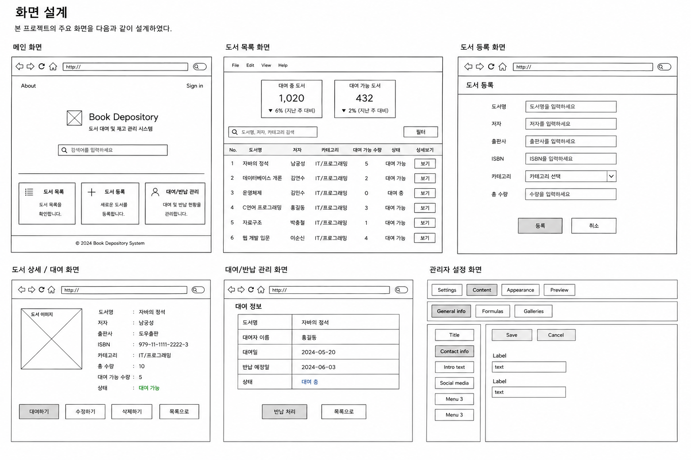

# 프로젝트 구조 및 역할·일정 관리 계획

## 1. 프로젝트 개요

본 프로젝트는 도서 정보를 등록하고, 대여 및 반납 상태를 관리하며, 현재 재고를 확인할 수 있는 JSP/Servlet 기반 웹 시스템이다.

1주차에는 프로젝트 개요를 작성하였고, 2주차에는 요구사항 분석 및 시스템 설계를 진행하였다.  
3주차에는 이를 바탕으로 실제 구현을 위한 프로젝트 구조, 역할 분담, 일정 관리 계획을 수립한다.

---

## 2. 프로젝트 구조 설계

### 2.1 전체 시스템 구조

본 프로젝트는 MVC 디자인 패턴을 기반으로 구성한다.

```text
[사용자]
   ↓
[JSP View]
- 메인 화면
- 도서 목록 화면
- 도서 등록 화면
- 도서 상세 화면
- 대여/반납 화면

   ↓ 요청

[Servlet Controller]
- BookServlet
- RentalServlet

   ↓ 처리 요청

[Model]
- BookDTO
- RentalDTO
- BookDAO
- RentalDAO

   ↓ DB 처리

[Database]
- books 테이블
- rentals 테이블
```

### 2.2 기능 요소 구조

```text
도서 대여 및 재고 관리 시스템
│
├─ 도서 관리
│  ├─ 도서 등록
│  ├─ 도서 목록 조회
│  ├─ 도서 상세 조회
│  ├─ 도서 수정
│  └─ 도서 삭제
│
├─ 대여 관리
│  ├─ 도서 대여
│  ├─ 도서 반납
│  └─ 대여 상태 확인
│
└─ 검색 기능
   ├─ 도서명 검색
   ├─ 저자 검색
   └─ 카테고리 검색
```

### 2.3 화면 구조

| 화면 | 주요 기능 | 관련 요구사항 |
|---|---|---|
| 메인 화면 | 프로젝트 소개, 주요 메뉴 이동 | 전체 |
| 도서 목록 화면 | 도서 목록 조회, 검색, 상세보기 이동 | F-02, F-09 |
| 도서 등록 화면 | 도서명, 저자, 출판사, ISBN, 카테고리, 수량 입력 | F-01 |
| 도서 상세 화면 | 도서 상세 정보 확인, 대여, 수정, 삭제 | F-03, F-04, F-05, F-06 |
| 대여/반납 화면 | 대여 정보 확인, 반납 처리 | F-07, F-08 |

### 2.4 주요 구성 요소와 관계

| 구성 요소 | 역할 | 관련 기능 |
|---|---|---|
| JSP | 사용자 화면 출력 및 입력 폼 제공 | 목록 조회, 등록, 상세 조회, 대여/반납 |
| Servlet | 사용자 요청 처리 및 화면 이동 제어 | 등록, 수정, 삭제, 대여, 반납 |
| DTO | 도서 및 대여 데이터를 저장하고 전달 | 도서 정보, 대여 정보 |
| DAO | 데이터베이스 연결 및 SQL 처리 | CRUD, 대여/반납 처리 |
| Database | 도서 정보 및 대여 기록 저장 | books, rentals |

### 2.5 데이터 구조

| 테이블 | 주요 필드 | 설명 |
|---|---|---|
| books | book_id, title, author, publisher, isbn, category, total_count, available_count | 도서 정보 저장 |
| rentals | rental_id, book_id, renter_name, rental_date, return_date, status | 대여 및 반납 기록 저장 |

### 2.6 화면 설계 이미지

아래 이미지는 drawing tool을 이용하여 작성한 초기 화면 설계이다.  
실제 구현 과정에서 UI 배치와 세부 항목은 일부 변경될 수 있다.



---

## 3. 역할 분담

| 팀원 | 담당 역할 | 책임 범위 |
|---|---|---|
| 최수민 | JSP/Servlet 구현, GitHub 관리 | Servlet 요청 처리, JSP 화면 흐름 구성, GitHub Repository 및 Issue 관리 |
| 정유승 | DB 설계, UI 구현 | 도서/대여 데이터 구조 정리, JSP 화면 구성, 화면 설계 이미지 정리 |

---

## 4. 협업 및 의사소통 방안

- GitHub Repository를 중심으로 프로젝트 파일을 관리한다.
- GitHub Issue를 활용하여 기능별 작업 진행 상황을 확인한다.
- Commit 메시지에는 작업 내용을 명확하게 작성한다.
- 수업 시간 및 메신저를 통해 진행 상황을 공유한다.
- 문서 수정, 화면 설계, 기능 구현 내용은 팀원 간 확인 후 반영한다.

---

## 5. 일정 관리 계획

### 5.1 주차별 세부 일정

| 주차 | 작업 내용 | 담당 | 결과물 |
|---|---|---|---|
| 1주차 | 프로젝트 주제 선정, Repository 생성, README 작성 | 전체 | README.md, 프로젝트 개요 |
| 2주차 | 기능적/비기능적 요구사항 분석, MVC 설계, DB 필드 초안 작성 | 전체 | 요구사항 및 설계 문서 |
| 3주차 | 프로젝트 구조 설계, 역할 분담, 일정 관리 계획 작성 | 전체 | Project_Architecture_and_Schedule.md |
| 4주차 | Maven 프로젝트 생성, JSP/Servlet 기본 구조 작성 | 최수민 | 기본 프로젝트 구조 |
| 4주차 | books/rentals 테이블 구조 정리 및 화면 설계 보완 | 정유승 | DB 구조 초안 및 UI 설계 |
| 5주차 | 도서 등록 및 목록 조회 기능 구현 | 최수민 | 도서 CRUD 일부 |
| 5주차 | JSP UI 구현 및 도서 상세 화면 구성 | 정유승 | JSP 화면 구성 |
| 6주차 | 도서 수정/삭제 및 기능 통합 | 최수민 | CRUD 기능 통합 |
| 6주차 | 대여/반납 기능 및 검색 기능 구현 | 정유승 | 대여 및 검색 기능 |
| 7주차 | 화면 연결 및 오류 수정 | 전체 | 통합 테스트 결과 |
| 8주차 | WAR 파일 생성, GitHub Release 등록, 발표 준비 | 전체 | 최종 결과물 |

---

### 5.2 마일스톤

| 마일스톤 | 목표 | 완료 기준 |
|---|---|---|
| Milestone 1 | 프로젝트 기획 완료 | README 및 프로젝트 개요 작성 완료 |
| Milestone 2 | 요구사항 및 설계 완료 | 요구사항 문서, MVC 설계, 화면 설계 작성 완료 |
| Milestone 3 | 구조 및 일정 계획 완료 | 구조도, 역할 분담표, 일정표 작성 완료 |
| Milestone 4 | 핵심 기능 구현 | 도서 등록, 조회, 수정, 삭제 기능 구현 |
| Milestone 5 | 대여/반납 기능 구현 | 대여 가능 수량 변경 및 반납 처리 구현 |
| Milestone 6 | 최종 제출 준비 | 테스트 완료, WAR 파일 생성, GitHub Release 등록 |

---

### 5.3 중간 점검 계획

| 점검 시점 | 점검 내용 |
|---|---|
| 매주 수업 전 | GitHub Issue 진행 상황 확인 |
| 기능 구현 전 | 요구사항과 화면 설계 일치 여부 확인 |
| 기능 구현 중 | 팀원별 담당 기능 진행 상태 확인 |
| 기능 구현 후 | 도서 등록, 조회, 대여, 반납 기능 정상 동작 확인 |
| 최종 제출 전 | README, docs, 소스코드, WAR 파일, Release 등록 여부 확인 |

---

## 6. AI 활용 내역
-초안을 작성.
-프로젝트 구조 정리, MVC 구성 요소 설명, 역할 분담표 작성, 일정표 초안 구성에 활용

## 7. 팀원 활동 내역
-도서 대여 및 재고 관리 시스템 주제에 맞게 기능 요소, 역할 범위, 일정 계획을 수정 및 보완
-GitHub Repository 관리, 문서 수정 및 최종 내용 검토
